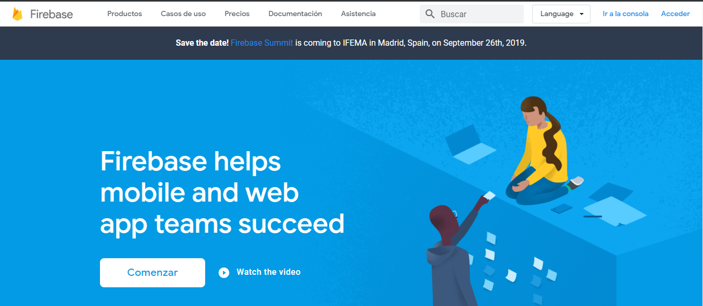
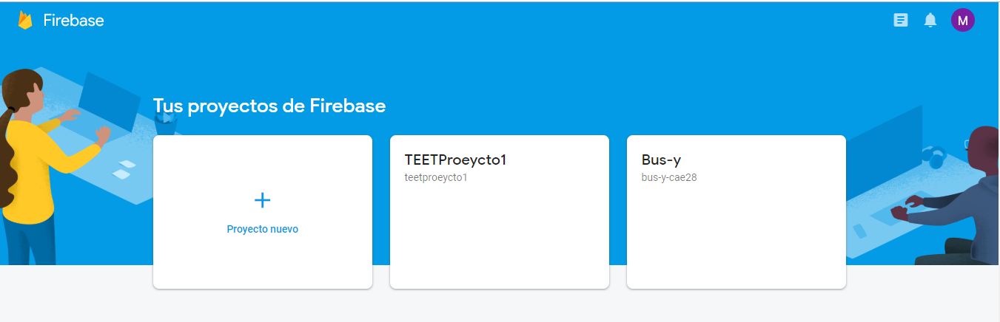
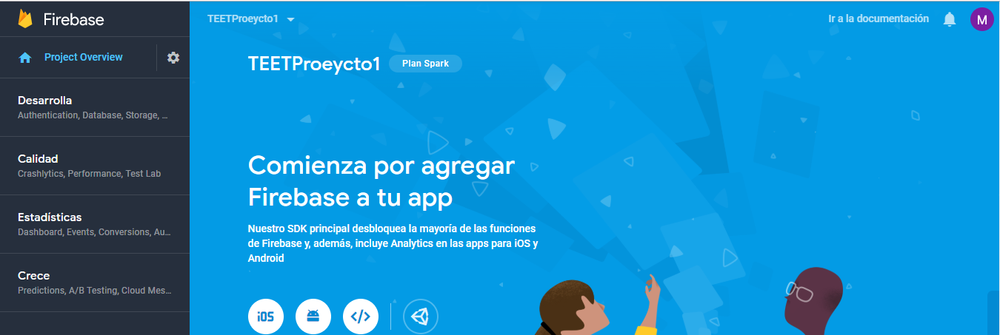
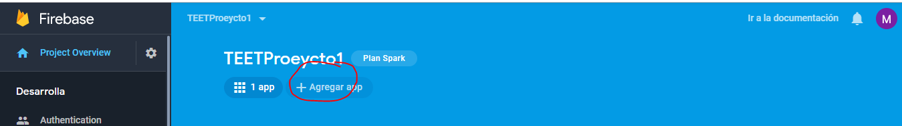
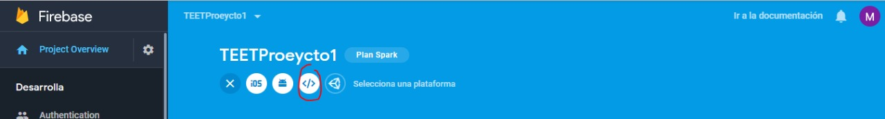
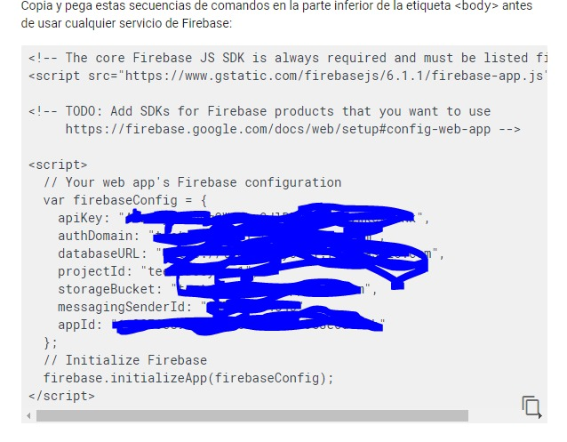
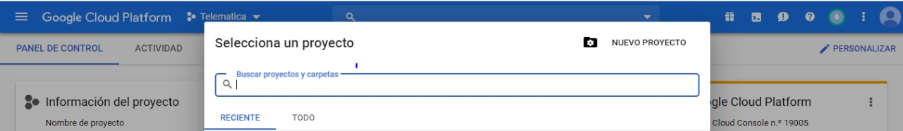
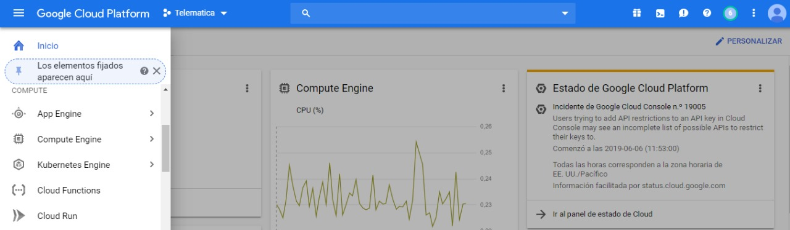
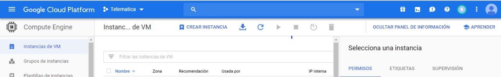
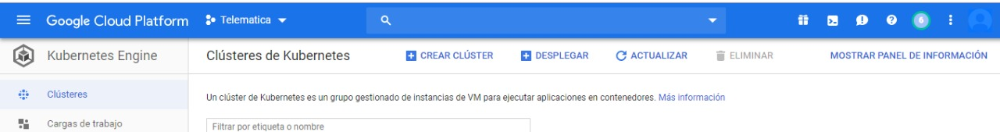

This project was bootstrapped with Create React App.

## Proyecto 1 de la materia Topicos Especiales en Telematica

### Enunciado
Se requiere el desarrollo de una aplicación de registro de posición (tracking-gps) en tiempo real (tipo IoT) utilizando un framework web moderno (javascript, angular, nodejs, o ruby, django-python, etc), utilizando mejores prácticas DevOps para integración y entrega continua distinguiendo los diferentes ambientes.

### Ambientes Utilizados
#### Desarrollo
#### Pruebas (DCA IP Privada y Docker con dominio correspondiente)
#### Produccion (Maquina CentOs7 de AWS)
#### Implemetacion
#### 1. Log-in y Sign-in
Para la parte de autenticacion del usuario se uso Google Firebase ya que era la manera mas rapida y facil de conectar al framework del proyecto (React.js)

##### 2. Mapa y Tracking
Para la parte del tracking se uso una API de Google Maps y unas funciones en el framework para que usara la localizacion actual del usuario, esta se actualiza cada 3 segundos y al darle el boton Empezar, se imprimira la localizacion en la pagina hasta que el usuario le de en el boton Parar

### 3. Configuración de Kubernetes

